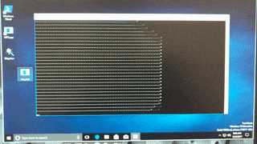

# dasDriver
Device driver for a [pci-das08](https://www.mccdaq.com/pdfs/manuals/pci-das08.pdf) audio card.

Written for device drivers class at WWU




```

Select Option: 

1.  Set Channel
2.  Get Channel
3.  Set Rate
4.  Get Rate
5.  Start Sampling
6.  Stop Sampling
7.  Read from Device
8.  Osciliscope (DANGER)
9.  Write Data to File
10. Exit
Select Option: You will HAVE to press CTRL-C to exit this mode!
How many data points should be retrieved at a time? 
```